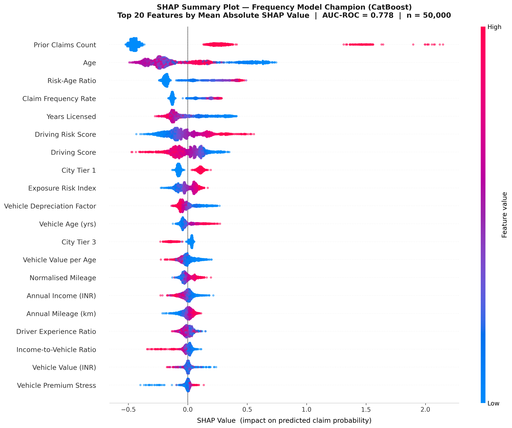
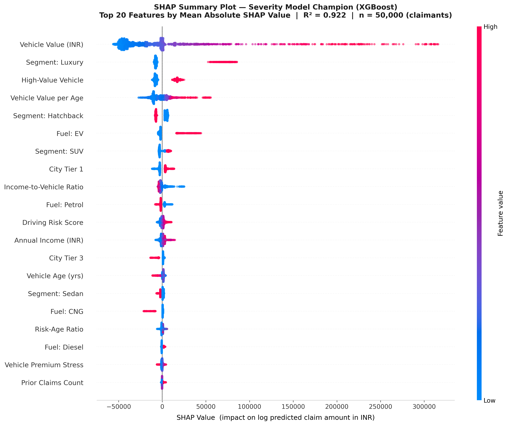

# 🚗 Intelligent Risk-Based Premium Pricing Engine for Car Insurance Using Agentic AI

## 📌 Overview
This project is a **production-grade AI-powered car insurance pricing platform** that calculates **personalized insurance premiums** based on a customer's risk profile.

Unlike traditional fixed pricing systems, this platform uses:
- Machine Learning (Frequency–Severity Modeling)
- Explainable AI (SHAP)
- Agentic AI (Analytics + Underwriting Agents)
- Actuarial Pricing Principles

to deliver **accurate, transparent, and fair premium decisions**.

---

## 🎯 Core Principles

- **Actuarial Correctness**  
  Premium = Expected Loss × Loading Factor × Business Rules  
  where  
  Expected Loss = P(Claim) × E(Claim Amount)

- **Separation of Concerns**  
  Each layer (ML, Pricing, API, Agents, DB, Frontend) is modular and independently testable.

---

## 🚀 Key Features

- 🔍 Personalized premium pricing using ML  
- 📊 Frequency–Severity risk modeling  
- 🧠 SHAP-based explainability (global + local)  
- 🤖 Agentic AI:
  - Analytics Agent (natural language insights)
  - Underwriting Agent (risk + fraud detection with HITL)  
- ⚙️ Rule-based pricing engine (actuarial logic)  
- 🔁 Model retraining & governance pipeline  
- 🔐 JWT-based admin authentication  
- 📈 Driver Safety Score  
- 🐳 Fully Dockerized system  
- 🌐 FastAPI REST APIs  
- 🗄️ PostgreSQL database (async ORM)

---

## 🧠 Tech Stack

### Backend
- Python, FastAPI, SQLAlchemy (async), Pydantic  

### Frontend
- React (TypeScript), Tailwind CSS, Recharts  
- React Router, React Query, React Hook Form  

### Machine Learning
- CatBoost (Primary), XGBoost, LightGBM  
- SHAP (Explainability)  

### AI / Agents
- LangChain (SQL Agent)  
- LangGraph (Underwriting Agent)  
- Groq LLM (LLaMA-based)  

### Database
- PostgreSQL (JSONB, UUID, indexed tables)  

### DevOps
- Docker, Docker Compose  
- APScheduler (retraining jobs)  

---

## 🏗️ System Architecture

```
┌─────────────────────────────────────────────────────────────────┐
│  Customer Browser (React + Tailwind + Recharts)                  │
│  Multi-step Quote Form → Premium Display → Policy Purchase      │
└──────────────────────────────┬──────────────────────────────────┘
                               │ REST API
┌──────────────────────────────▼──────────────────────────────────┐
│  FastAPI Backend (src/api/)                                      │
│  POST /quote  POST /policies  POST /claims  GET /admin/*        │
└────────────┬────────────────────────────────────────────────────┘
             │
     ┌───────▼────────┐   ┌──────────────────────────────────────┐
     │ ML Models       │   │ Pricing Engine (rules-based)         │
     │ Claim Frequency │──▶│ expected_loss = P(claim) × severity  │
     │ (CatBoost)      │   │ base_premium = expected_loss × 1.35  │
     │ Claim Severity  │   │ + business rules                     │
     │ (CatBoost)      │   │ → final premium (₹3k – ₹1.5L)        │
     └───────┬─────────┘   └──────────────────────────────────────┘
             │
     ┌───────▼──────────────────┐  ┌──────────────────────────────┐
     │ PostgreSQL (SQLAlchemy)   │  │ Feedback Loop (APScheduler)  │
     │ 11 tables + JSONB fields  │  │ Weekly retraining            │
     └───────────────────────────┘  └──────────────────────────────┘
             │
     ┌───────▼────────────────────┐
     │ NLP Assistant (LangChain)  │
     │ Natural Language → SQL     │
     └────────────────────────────┘
```

---

## 🧩 Detailed Architecture

- **Frontend Layer**
  - React SPA with multi-step quote wizard
  - Admin dashboard with JWT authentication
  - Axios interceptors for token handling

- **API Layer**
  - FastAPI (async)
  - Versioned APIs (`/api/v1`, `/api/v2`)
  - Middleware: logging, CORS, error handling

- **ML Layer**
  - Frequency Model → Claim probability  
  - Severity Model → Claim cost  
  - Combined Predictor → Expected Loss  

- **Feature Enrichment**
  - Vehicle risk mapping  
  - City risk indexing  
  - Driving score calculation  
  - No Claim Bonus (NCB)

- **Pricing Engine**
  - Deterministic (no ML)
  - Applies:
    - Loading factor (1.35)
    - Business rule multipliers
    - Floor & cap constraints

- **Explainability**
  - Global SHAP → overall feature importance  
  - Local SHAP → per-user explanation  

- **Agent Layer**
  - Analytics Agent → SQL insights via NLP  
  - Underwriting Agent → fraud/risk detection + HITL  

- **Database Layer**
  - PostgreSQL with async SQLAlchemy  
  - 11 tables, UUID PKs, JSONB columns  

- **Governance & Retraining**
  - Multi-algorithm training (XGB, LGBM, CatBoost)
  - Champion model selection  
  - Shadow deployment  
  - Atomic promotion + rollback  
  - Weekly retraining pipeline  

---

## 📸 Screenshots

  


---

## ⚙️ How to Run

### 🐳 Using Docker (Recommended)

```bash
docker-compose up --build
```

---

### 💻 Manual Setup

#### Backend
```bash
cd backend
pip install -r requirements.txt
uvicorn src.api.main:app --reload
```

#### Frontend
```bash
cd frontend
npm install
npm run dev
```

---

## 🔄 Workflow

1. User submits details via frontend  
2. Data is preprocessed and enriched  
3. ML models predict:
   - Claim probability  
   - Claim severity  
4. Expected Loss is calculated  
5. Pricing engine applies rules  
6. SHAP explains the decision  
7. Premium is displayed  

---

## 🔐 Security

- JWT-based authentication for admin  
- Read-only DB access for NLP agent  
- Parameterized SQL queries  

---

## 💼 Use Cases

- Insurance companies  
- InsurTech platforms  
- Risk analytics systems  
- AI-driven pricing engines  

---

## 🚀 Future Enhancements

- Telematics integration (real-time driving data)  
- Advanced fraud detection models  
- Cloud deployment (AWS/GCP)  
- Role-based access control  

---

## 👨‍💻 Author
**Sagar More**

---

## ⭐ Support
If you like this project, give it a ⭐ on GitHub!
